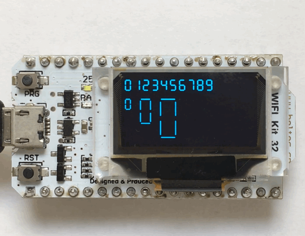

#Seven-Segment Display
## ESP32 Micropython OLED Example



### Requirements

####Adafruit OLED SSD1306 Library

[https://github.com/adafruit/micropython-adafruit-ssd1306]()

```
% curl https://raw.githubusercontent.com/adafruit/micropython-adafruit-ssd1306/master/ssd1306.py --output ssd1306.py
% ampy --port /dev/tty.SLAB_USBtoUART put ssd1306.py
```
